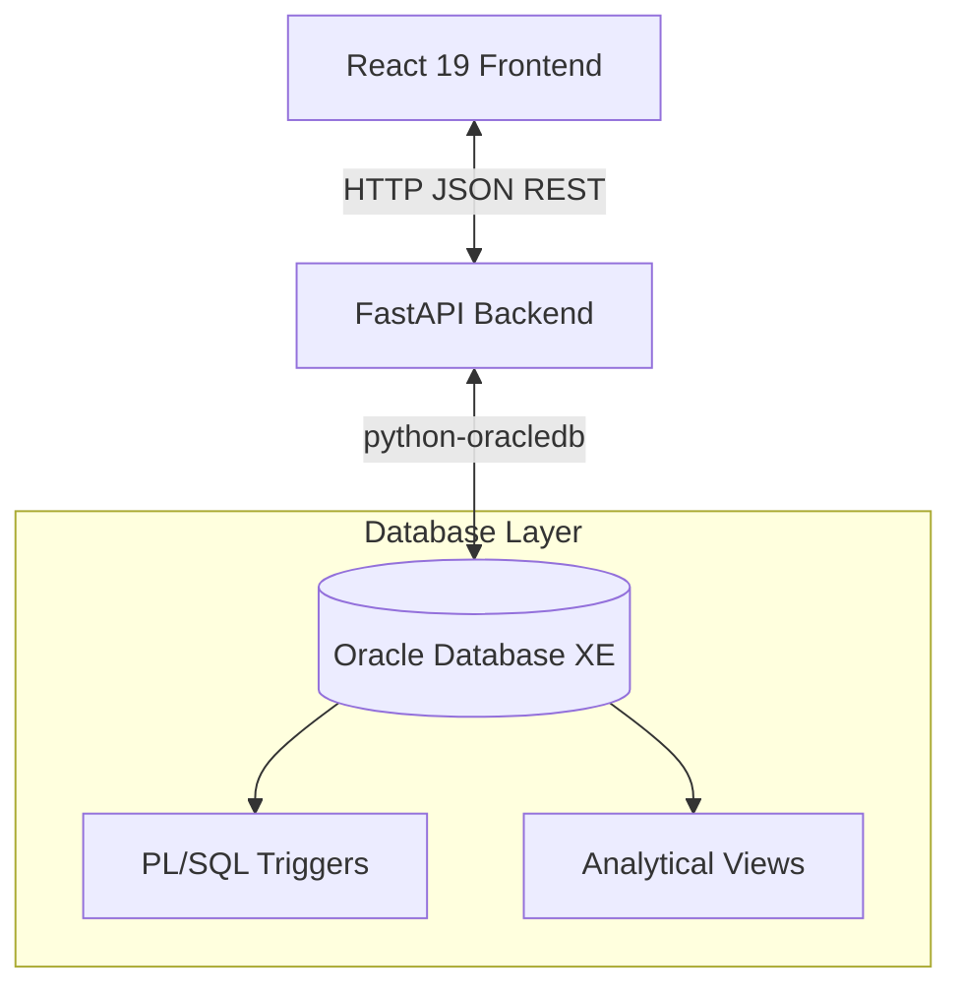

# 🏥 CareFlow Clinic Management System


CareFlow is a modern, full-stack Clinic Management System built to streamline daily healthcare operations. It provides a role-based portal for Patients, Doctors, and Administrators, backed by a FastAPI backend and a robust Oracle SQL database engine utilizing advanced PL/SQL triggers and analytical views.

---

## 🚀 Features

### 👤 Patient Portal
* **Registration**: Quick registration workflow for new patients.
* **Appointments**: Access complete history of scheduled visits, dates, and timeslots.
* **Prescriptions**: View prescribed medications, dosages, frequency, and treatment durations.

### 👨‍⚕️ Doctor Portal
* **Schedule Viewer**: Chronologically ordered schedule showing upcoming patient appointments.
* **Clinical Records**: Write and upload symptoms, diagnoses, and treatment plans.
* **E-Prescribing**: Log patient prescriptions with integrated medication lookups.

### 🧑‍💼 Admin Portal
* **Personnel Management**: Onboard new doctors and clinical staff into their respective departments.
* **Department Control**: Define medical departments and assign clinical head doctors.
* **Billing System**: Oversee clinic bills, generate invoices, filter records, and update payment statuses (Cash, Card, UPI).
* **Analytics Dashboard**: Real-time revenue details (paid vs. pending), appointments per department, doctor workload trends, and top prescribed medications.

### ⚙️ Database Automation (Oracle PL/SQL)
* **Auto-Billing Trigger**: Triggers upon appointment booking to create a default pending invoice.
* **Doctor Allocation Trigger**: Automatically assigns a default doctor if none is specified during scheduling.
* **Financial Guardrail Trigger**: Restricts patients with outstanding unpaid bills from scheduling new appointments.

---

## 🏗️ Architecture



---

## 🛠️ Technology Stack

* **Frontend**: React 19, React Router v7, Recharts (Data Visualization), Lucide React (Icons), Vite
* **Backend**: FastAPI, Pydantic, Python-oracledb, Uvicorn
* **Database**: Oracle Database, SQL, PL/SQL Triggers & Views

---

## 📁 Repository Directory Structure

```text
careflow-clinic-management/
├── backend/            # FastAPI python source code
│   ├── models/         # Pydantic validation models
│   ├── routes/         # Router controllers defining API endpoints
│   ├── services/       # Core business logic and database queries
│   └── utils/          # Authentication helpers and authorization guards
├── database/           # Oracle SQL scripts
│   ├── triggers/       # Custom PL/SQL triggers for business logic
│   ├── views/          # Analytical views for dashboard graphs
│   ├── create_tables.sql  # Schema definitions
│   └── insert_init_Data.sql  # Seed data
├── frontend/           # React 19 dashboard UI
└── ER.jpeg             # Entity-Relationship diagram
```

---

## ⚙️ Getting Started & Local Installation

### 1. Database Setup
1. Ensure you have an **Oracle Database** instance running locally (e.g., Oracle XE).
2. Connect to your database command line using `sqlplus`:
   ```bash
   sqlplus clinic_user/clinic123@localhost/XEPDB1
   ```
3. Run the schema creation script to setup tables and sequences:
   ```sql
   @database/create_tables.sql
   ```
4. Seed the database with initial clinic records:
   ```sql
   @database/insert_init_Data.sql
   ```
5. Apply the analytical views:
   ```sql
   @database/views/appointment_per_Dept.sql
   @database/views/appointment_trend.sql
   @database/views/appointments.sql
   @database/views/revenue_summary.sql
   ```

### 2. Backend Setup
1. Navigate to the `backend` directory:
   ```bash
   cd backend
   ```
2. Install the Python dependencies:
   ```bash
   pip install -r requirements.txt
   ```
3. Run the development server:
   ```bash
   uvicorn main:app --reload
   ```

### 3. Frontend Setup
1. Navigate to the `frontend` directory:
   ```bash
   cd frontend
   ```
2. Install the frontend dependencies:
   ```bash
   npm install
   ```
3. Launch the Vite local dev server:
   ```bash
   npm run dev
   ```


